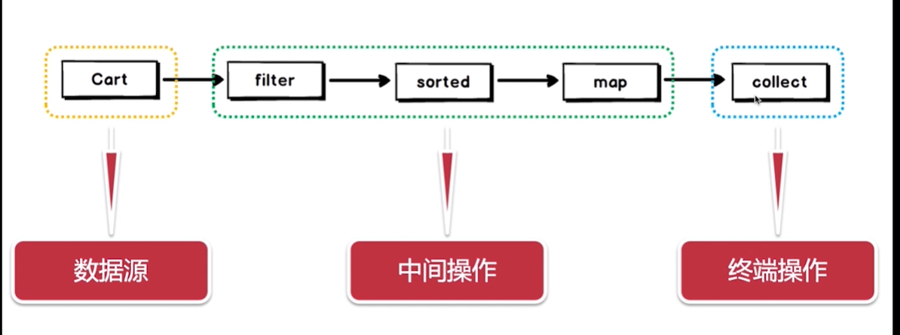

# 第1节：流

#### 流的简介
从支持 数据处理操作 的 源 生成的 元素序列   - - -java8实战

#### 流与集合的区别
集合更像是空间上的概念 面向存储
流 更像是时间上的概念 面向计算

集合可以遍历多次 流只能遍历一次

集合是外部迭代 流是内部迭代

#### 流的组成
1、数据源 
2、中间操作 业务处理
3、终端操作 流数据的收集

#### 流操作的分类

有无状态操作：
有状态：基于所有数据的基础上
无状态：当前数据的判断，不需要建立在所有的数据基础上 

终端操作：
非短路：每一个数据都要去操作
短路：找到即停止

#### 实战演练

##### 过滤 映射 扁平化

###### filter
满足即保留 满足这个条件就留下，不满足的过滤掉

###### map
将一个元素转化为另一种形式的元素
比如要操作的元素是一个商品对象，那经过map后可以得到这个流中间指定一个成员变量的集合
`@Test
    public void mapTest(){
        sukList.stream()
                .map(suk -> suk.getName())
                .forEach(System.out::println);
    }`

运行结果

###### flatmap
扁平化流 将元素映射为另一个流
``
@Test
    public void flatMapTest(){
        sukList.stream()
                .flatMap(suk -> Arrays.stream(suk.getName().split("")))
                .forEach(System.out::println);
    }
    ``
运行结果

