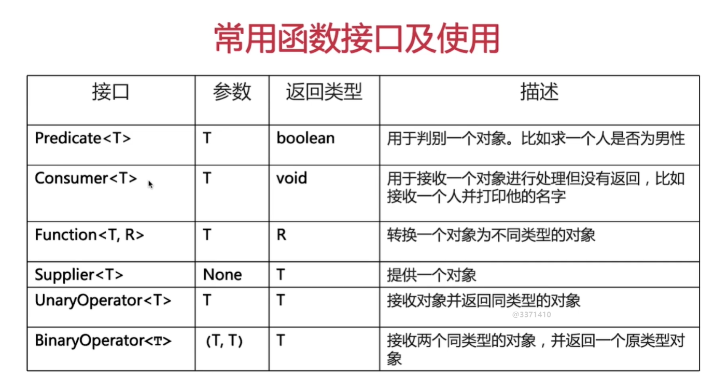
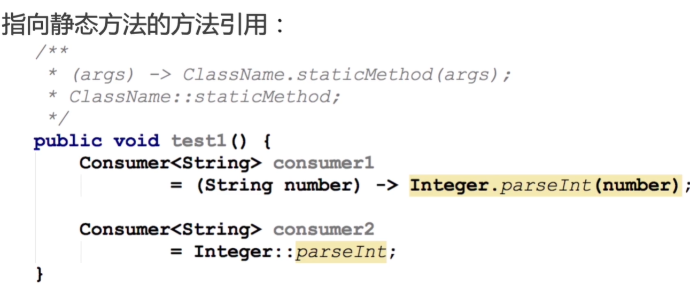
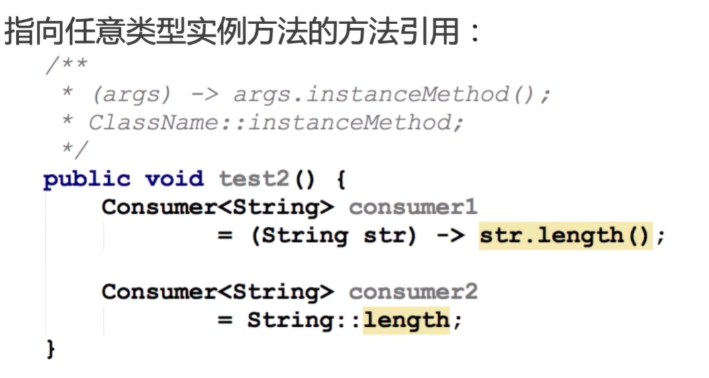
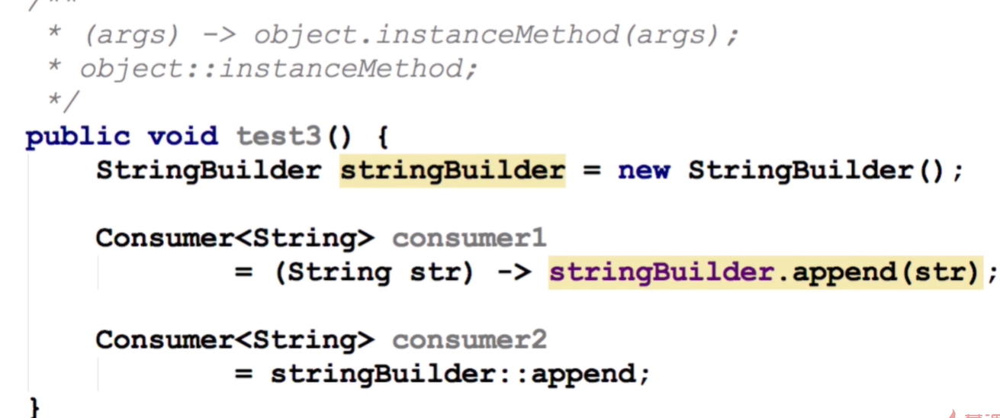

# 第1节：lambda表达式
* lambda表达式的形式
    * （parameters）-> (expression)
    * (parameters)->{statement;}

* 函数式接口
    * 实现的条件：接口中只有一个抽象方法
    * java8的函数式子接口注解：@FunctionInterface
    * 函数式接口的抽象方法签名：函数描述符

方法引用：
调用特定方法的lambda表达式的一种快捷写法
形式： 
目标引用 ：：方法名
方式
1、指向静态方法的引用

2、指向任意类型实例方法的引用

3、指向现有对象的实例方法的方法引用

