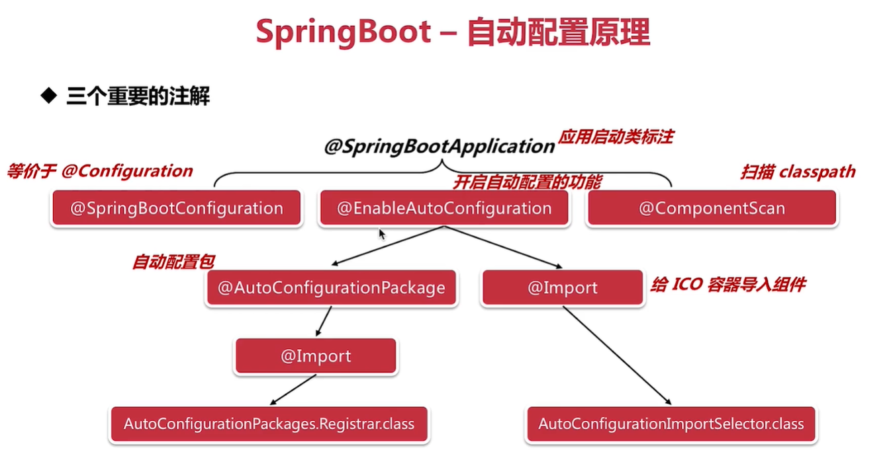
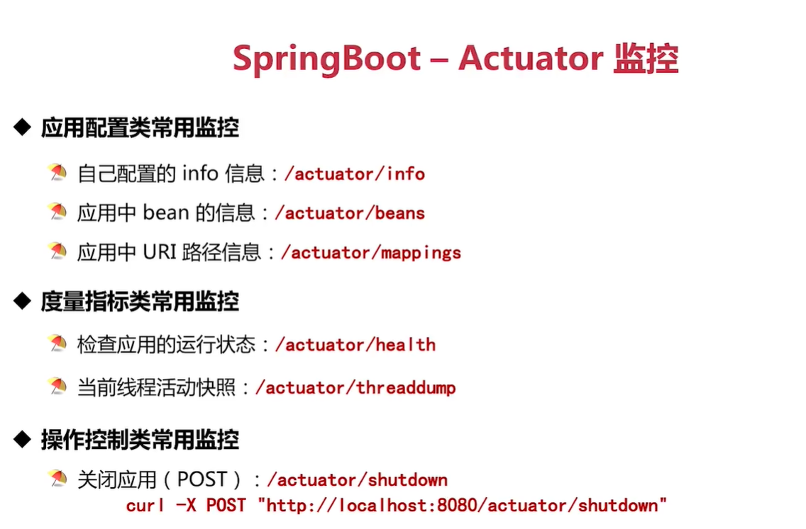

# 第2节：SpringBoot

## 自动配置


核心实现在loadSpringFactories方法中

## 配置文件
application与bootstrap


## 配置数据注入
1、直接@Value
2、需要导入相关的依赖;
```
 <!-- 专门用于数据绑定的依赖 -->
        <dependency>
            <groupId>org.springframework.boot</groupId>
            <artifactId>spring-boot-configuration-processor</artifactId>
            <optional>true</optional>
        </dependency>
```
第二种方式还需要有一个配置类 

## 定时与异步任务

1、在启动类处需要加注解``@EnableScheduling``来说明该应用开启定时任务


#### 异步任务
在启动类上加注解``@EnableAsync``来说明该任务是异步的

## 开启启动
程序启动后完成一段程序

1、默认的优先级是ApplicationRunner 高于CommandLineRunner
2、如果想更改执行的先后顺序 需要加@Order注解 自定义优先级

## actuator
监控 


