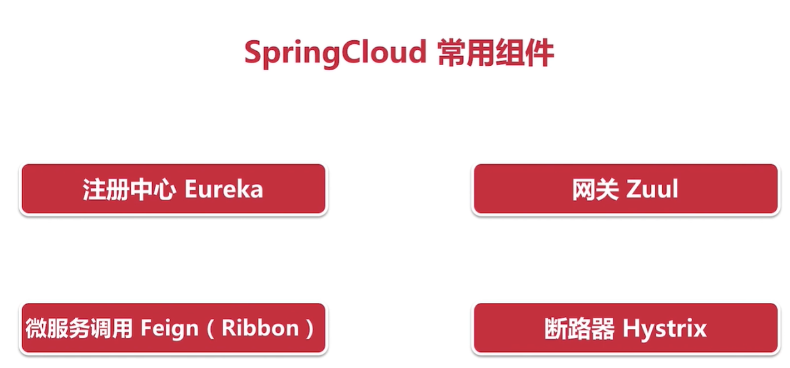
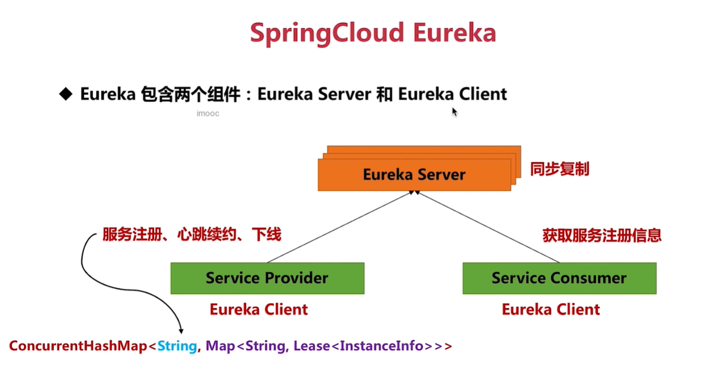
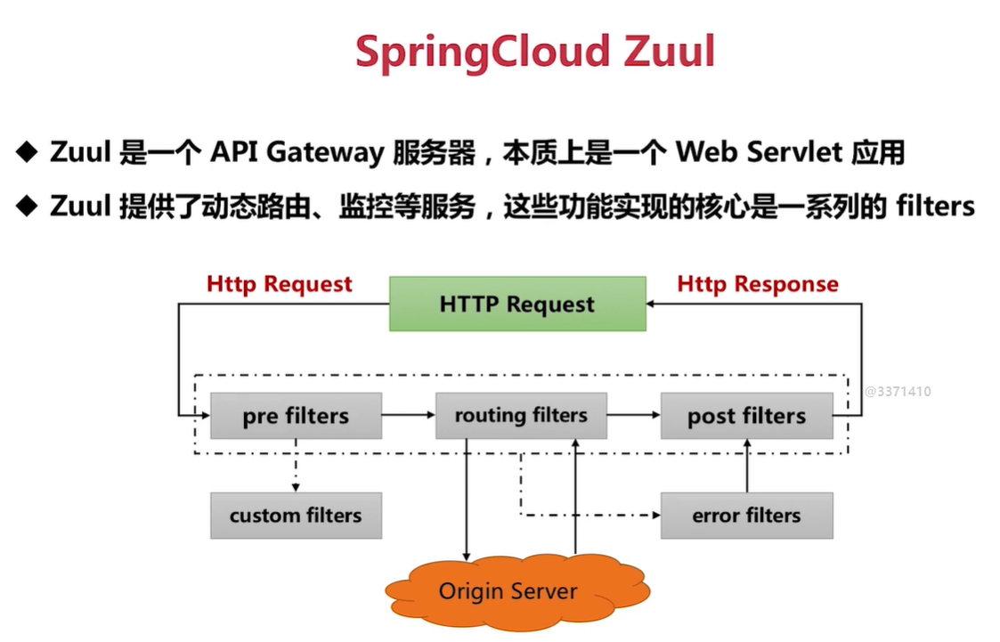
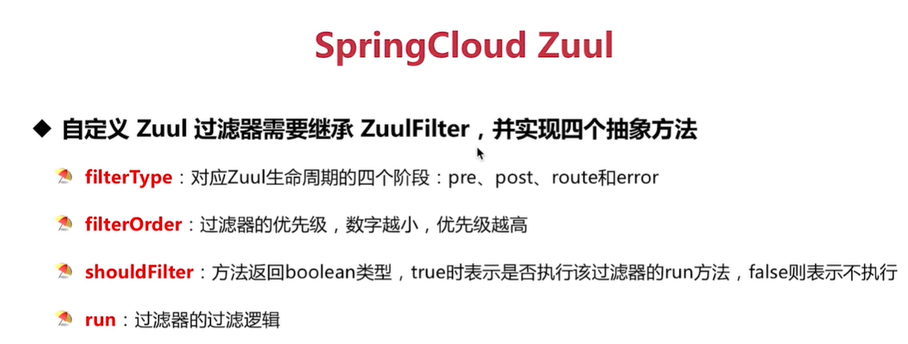

# 第3节：SpringCloud

## Eureka

其中Eureka简称就是我们的微服务

服务注册：
client向server注册 
心跳续约：
client与server维系的心跳 表明client存活
下线：
client 被通知关闭 client向server发送下线通知 将该服务的元信息清除

不管是消费者还是生产者 都是client

在上图下面的双层Map中 外层的map的key是应用名称 内层的map的key是应用中实例名称 内层map的value就是该实例的信息

## 注意
多个实例的注册
1、在配置文件中多个实例的application  name都是一样的 否则不能相互注册
2、为什么禁用掉一台机器上多个实例呢？
因为这样做没有意义 不允许在同一ip下创建不同的Eureka实例

每一个Eureka server 都需要配置其他实例的地址 这样才能实现不同欧冠实例之间的相互注册

## Zuul
实现：由一堆过滤器完成

自己可以编写自定义的过滤器
需要实现下面四个方法

filterOrder针对的是同一类的多个过滤器

