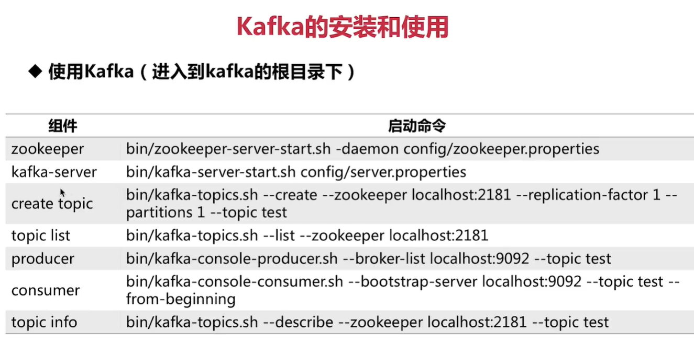
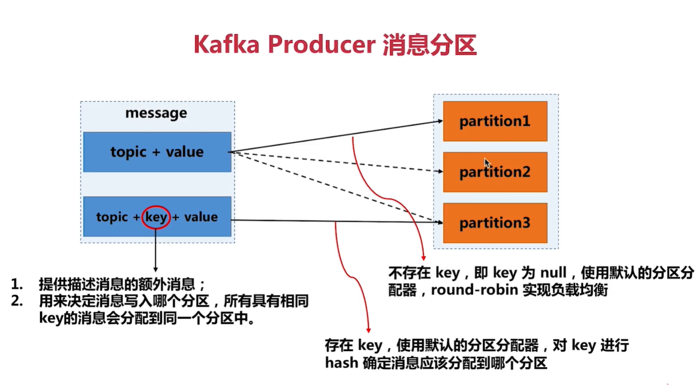

# 第1节：tool
## maven
#### 如何创建一个父子关系的多模块项目
1、父模块中只有pom文件 且pom文件的package标签是**pom** 不是默认的jar或者指定的war
2、父模块中要有modules来管理各个子模块
3、父模块需要使用dependencyManagement来管理各个子模块的依赖版本等等
4、每个子模块需要使用parent标签来指定父项目

## redis
非关系型数据库
#### 基本数据类型
String
List 序列集合 不要求元素唯一 
Hash 字典 多个k v 数据 HashMap
Set 对元素要求唯一 并集差集等等
SortedSet 有权重的排序 使用场景：排行榜

#### 特性
1、redis所有操作都是原子的 因为单线程
2、可对key设置过期时间
    redis如何删除的：
        - 定时删除
        - 惰性删除
        - 定期删除
3、支持两种持久化方式：RDB（快照 默认）、AOF
    - RDB 全部数据导出到磁盘 几乎没被使用
    - AOF 将用户的指令保存 

#### 速度快？为啥
1、完全基于内存
2、数据结构简单
3、单线程没有切换
4、多路复用IO模型

#### 缓存相关
###### 缓存雪崩
Cache设置了相同的过期时间 导致Cache在同一时间失效 请求全都转发到数据库中 数据库压力瞬间增大 造成雪崩
解决方案：给key设定不同的随机过期时间
###### 缓存穿透
查询一个不存在的值 但是由于Cache没有命中 有需要去数据库中查 造成性能下降 
解决方案： 给没有命中的Key设定"没有意义的空值"

#### IO相关
多路复用

## JPA

## kafka
#### 消息系统
点对点
发布与订阅
#### kafka术语
优势：
- 分区机制 副本机制 容错机制
- 支持集群规模的热扩展
- 高性能

topic：
partition：（分区）
- 多个partition构成一个topic 
- 每个partition的数据会使用多个文件进行存储
- 且partition的数据是有序的
 对于数据有序的理解
- 可想象每一个partition都是一个单独的队列 都属于一个topic
- 但是如果partition的数量超过一个 那这几个partition的数据放在一起就是无序的了
- 如果有消息严格按着顺序消费 那就把partition的数量设置为1就可以了
- 每一个partition都有一个偏移量来记录数据（每个消息）的位置
- 还有副本的概念 副本不会被消费者消费 副本这只是为了防止数据的丢失
- 单机的kafka是不能设置副本的 副本只能在不同机器上进行设置

brokers：每一台服务器就是一个kafka broker
如果存在多个partition 也存在多个broker 那每个partition（属于同一个topic）会分布在不同的broker上 
自动实现的负载均衡

producer：将消息发送到topic中的partition中

consumer：从broker读取数据 可消费多个数据
多个consumer就组成了消费者组groups

#### kafka的安装与使用

#### kafka发送消息与消费消息

使用上述命令即可达到

####  kafka producer 消息分区

#### kafka消费者组

多个分区对应一个消费者组 则是平均消费的 
