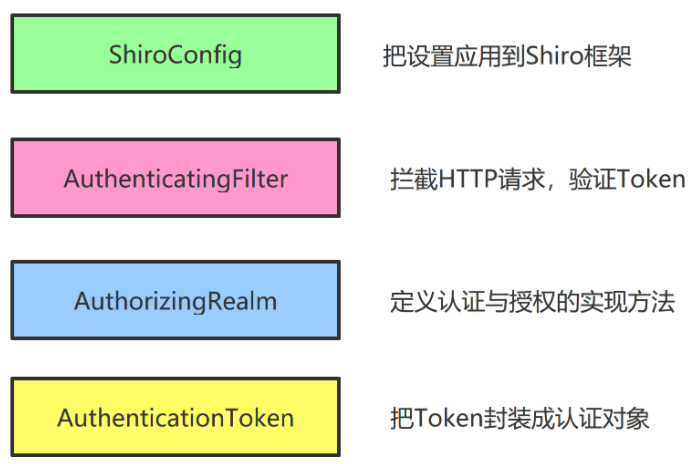

# 第2节：shiro

- ShiroConfig 把设置应用到Shiro框架
- AuthenticatingFilter 拦截HTTP请求 验证Token
- AuthorizingRealm 定义认证与授权的实现方法
- AuthenticationToken 把Token封装成认证对象

所以客户端传上来的token不能直接给Shiro 需要先封装成AuthenticationToken对象

## 刷新令牌
两种方式：
1、双token
2、Token缓存

## 创建ShiroConfig类
### 把Filter和Realm类添加到Shiro框架中
### 创建四个对象返回给SpringBoot
1、SecurityManager
用于封装realm对象
2、ShiroFilterFactoryBean
用于封装Filter对象、设置filter的拦截规则
3、LifecycleBeanPostProcessor
管理Shiro对象生命周期
4、AuthorizationAttributeSourceAdvisor
AOP的切面类
对web方法执行前 验证权限