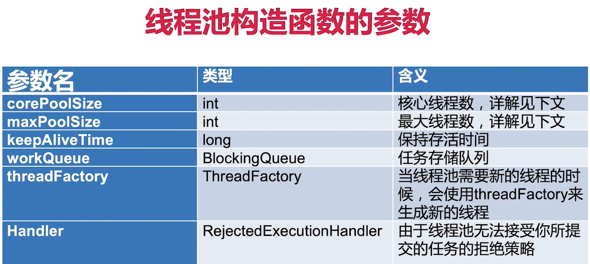
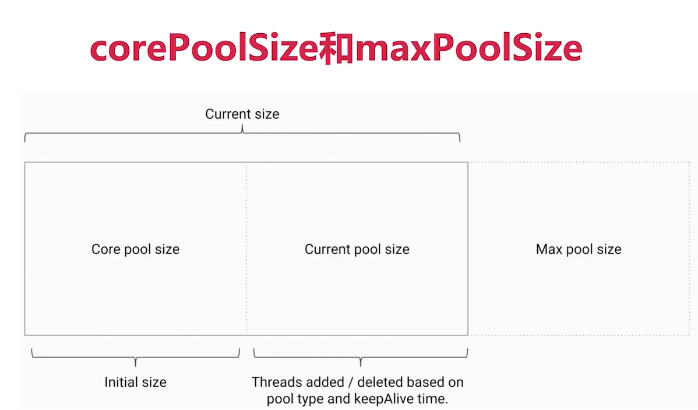
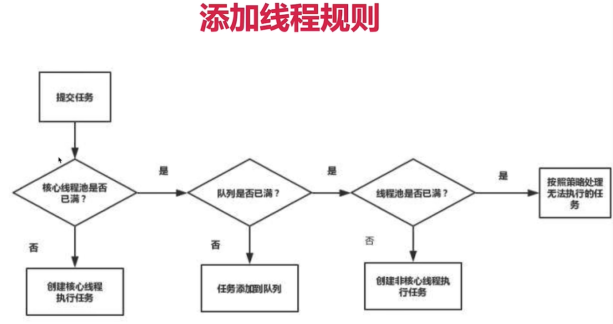
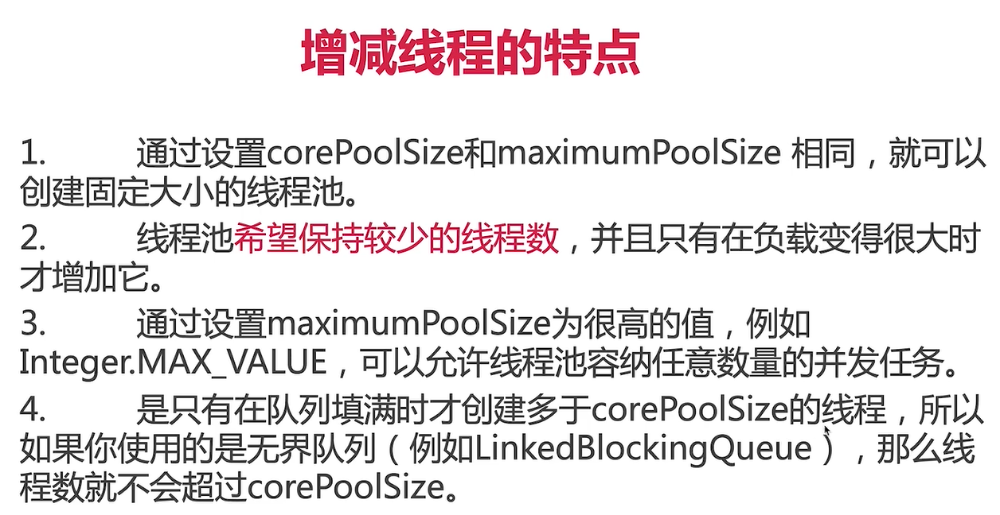
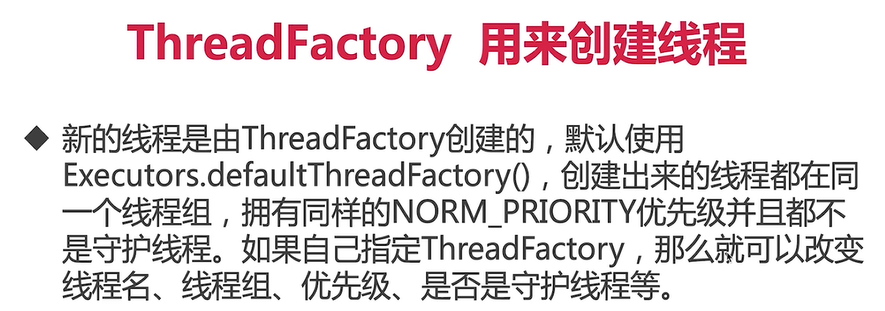
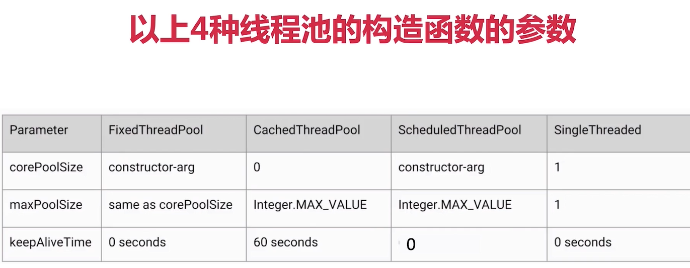
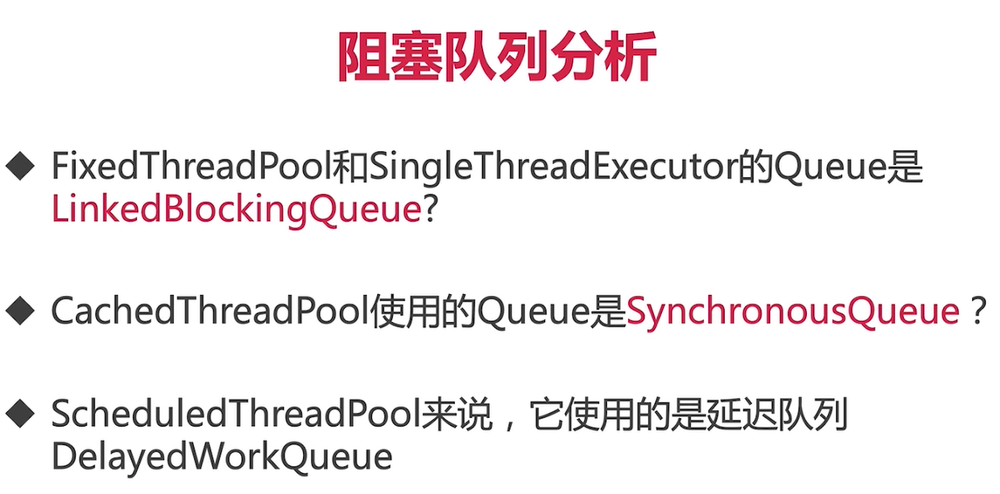
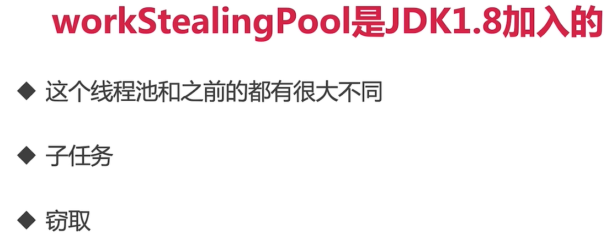
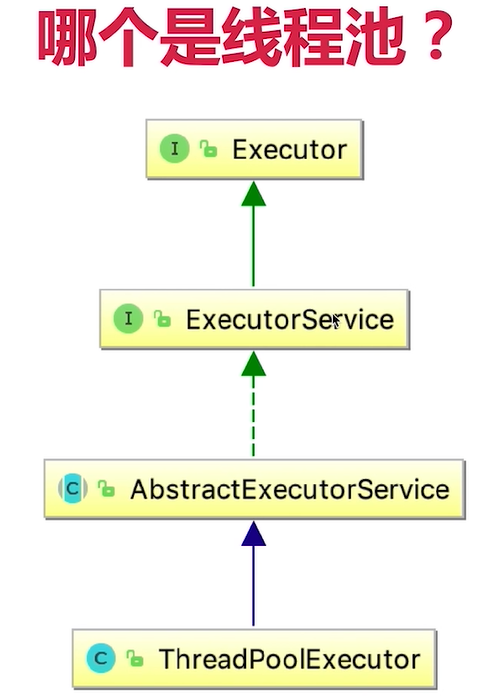
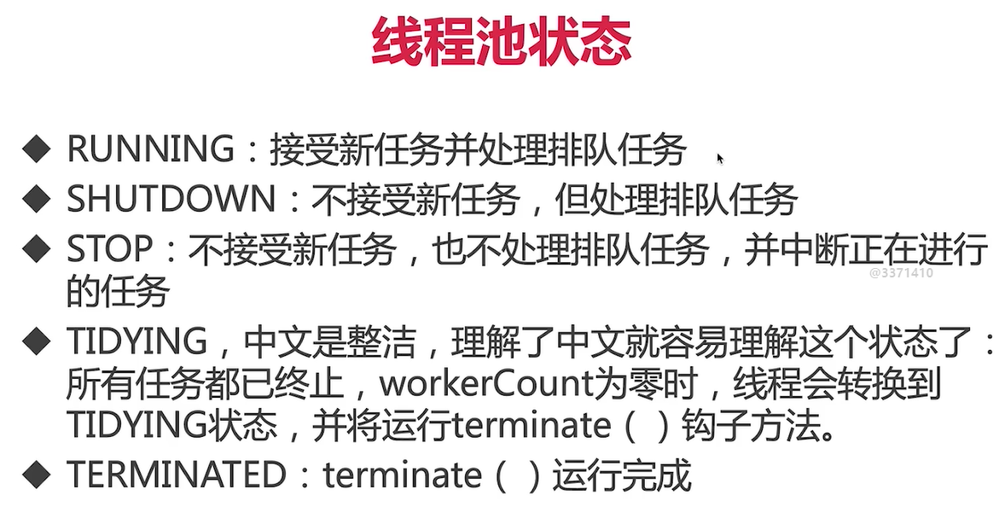

# 第2节：并发

### 并发工具类的分类
1、为了并发安全
- 互斥同步
    - 锁 资源是占有的却不共享
- 非互斥同步
    - 可同时使用资源 原子类
- 无同步方案
    - ThreadLocal
    - final
2、管理线程、提高效率
3、线程协作

### 线程池
1、线程池的重要性
- 为什么使用线程池？
    - 在资源有限的情况下 省去了创建线程和销毁线程的开销 而且还可以复用线程
    - 我们可以使用循环的方式去创建新的线程 但是一个系统的线程是有上限的 如果过多的线程需要创建必然会给内存等带来巨大的压力。
    - 创建了，要不要回收？要的，线程销毁后相关的内存需要被回收，那也给垃圾回收器造成压力

2、好处
- 速度快了
- 合理的统筹cpu和内存
- 统一管理资源 也方便数据统计

3、场合
- 服务器接受大量的请求时
- 平时开发

### 创建与停止线程池
#### 创建
##### 线程池构造函数的参数

- corePoolSize 与 maxPoolSize
    - corePoolSize 核心的线程数 ：线程池在完成初始化后 默认情况下 线程池中并没有任何线程，线程池会等待有任务到来的时候，再去创建新线程去执行任务 
        - 该参数的设定值 是线程长时间不会销毁的线程数量
    - maxPoolSize : 线程池有可能会在核心线程的基础上额外的增加一些线程，但是这些新增的线程数总得有一个上限，这就是最大量maxPoolSize

注释：
- 线程池初始化的时候的数量就是core 
- 当源源不断有任务到达的时候 会放进任务等待队列中
- 当我们的等待队列也满了 那线程池就会新建新的线程去完成任务 对应的就是图中的current size
- 那我们线程池新建的数量也是有一个上限的 上限就是max 

##### 添加线程规则
1、如果线程数小于core，即使其他工作线程处于空闲状态，也会创建一个新的线程来运行新的任务
2、如果线程数大于等于 core 但是小于max 则将任务放到队列中
3、如果队列也满了，并且当前线程数还是小于max的，那就创建一个新的线程来运行任务
4、如果队列满了，线程数也大于或者等于max了 那就会拒绝掉该任务

总结：
是否增加线程的判断顺序
- core
- workqueue
- max

举例：烧烤店

##### 增减线程的特点

##### keep alive time

##### Thread Factory

通常使用默认的就行了

##### 工作队列
1、直接交接 SynchronousQueue 内部没有容量 所以存不下任何任务 
2、无界队列 LinkedBlockingQueue 不会被塞满 可以应对徒增的流量 但是如果处理跟不上提交 就会有内存浪费和OOM的风险
3、有界队列 可设置队列大小 此时的max参数有意义。

##### 线程池应该手动创建还是自动创建

所以使用固定容量的线程池还是需要注意的

只有一个线程

这是一个无限创建线程的线程池

周期且延迟的做一些事情

###### 正确的创建线程池的方法
手动设置线程会好一些

##### 线程池中线程数量应该设定多少比较合适？

##### 常见的线程池的特点

#### 停止线程池
五种方法
1、shutdown
2、isShutDown 判断的是是否进入停止状态 但是返回true并不代表真的停止了 而是代表是否都进入开始停止的状态
3、isTerminated  判断的是整个程序是否停止并且任务是否完全结束
4、awaitTerminated 检测是否关闭
5、shutdownNow 立刻将线程池关闭掉 该方法有返回值 返回的是任务等待列表中没有完成的任务

#### 任务太多怎么拒绝
1、拒绝时机 
- 当Executor关闭时，提交新任务会被拒绝
- 当Executor对最大线程和工作队列容量使用有边界并且已经饱和的时候

##### 四种拒绝策略
1、AbortPolicy 抛异常
2、DiscardPolicy 丢弃任务且不通知
3、DiscardOldestPolicy 丢弃最老的任务
4、CallerRunsPolicy 给提交任务的去执行

#### 加料
1、首先新建线程后继承ThreadPoolExecutor类 重写部分方法
2、为了实现在线程执行之前需要做的操作 需要重写beforeExecute（）方法

#### Executor

1、Executor 顶层的接口 只有一个方法 就是execute()执行任务
2、ExecutorService 拥有初步管理线程池的方法 比如shutdown等等
3、Executors 是一个工具类 new各种线程池

##### 线程池如何实现线程复用
核心：相同的线程执行不同的任务
在ThreadPoolExecutor类中的runWorker（）方法中可以看到如何实现复用
就是直接调用run方法啦

#### 线程池的状态

#### 使用线程池的注意点
1、避免任务堆积
2、避免线程数过度增加
3、排查线程数量是否超过一定数量（线程泄漏）

