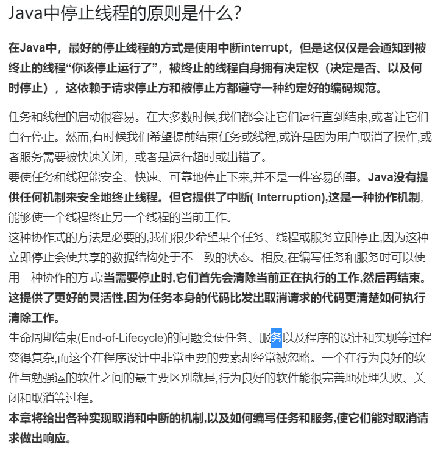
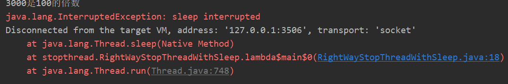
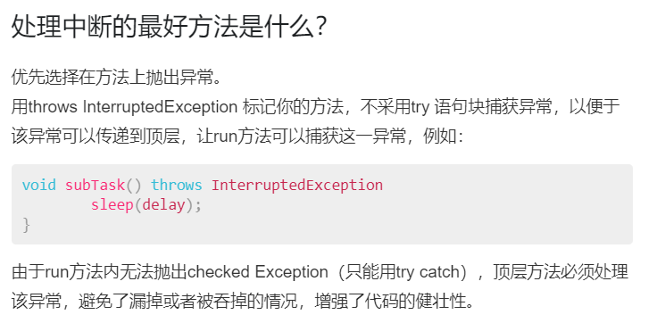
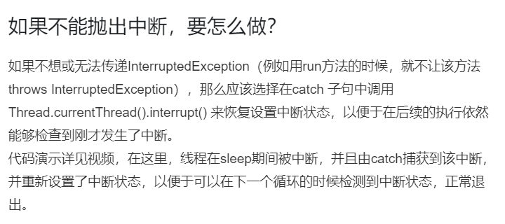
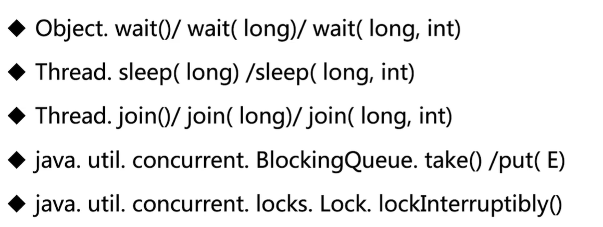
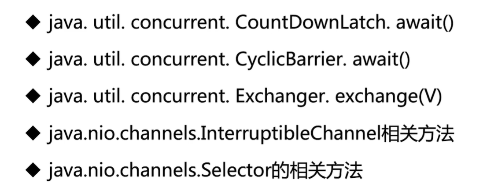
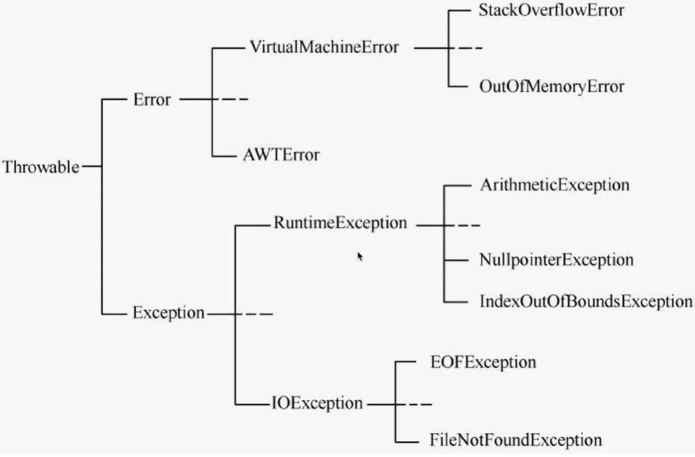
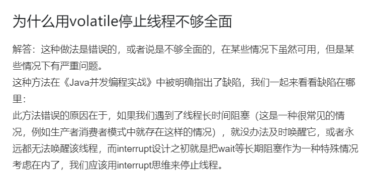

# 第1节：线程

## 线程的启动
1、一个线程两次调用start()方法会出现什么情况，为什么？
会抛出一个异常：线程状态检查的一个异常。因为一个线程已经start（）后状态就已经改变了。再调用start()的方法，首先去检查当前线程的状态，状态不符就报了异常。
2、既然start()方法会调用run()方法。为什么我们选择调用start()方法而不是直接调用run()方法呢？
只有调用start()方法才会使线程经历自己的生命周期，如果直接调用run那其实就是像调用一个方法一样，并不能启动一个线程。

## 如何正确停止线程

#### 使用interrupt来通知，而不是强制
是合作机制，让一个线程通知另一个线程去停止
interrupt 只是通知，而不是强行停止。最终的决定权在于线程本身
 

其实为什么将停止线程的权利给线程本身呢？
因为停止一个线程最终想让这个线程完成一系列的保资源处理等工作，对于这个线程而言，最了解其本身任务的是就是线程本身，所以将停止线程的工作给了线程自己去决定

## 实战
1、哪些情况线程会停止？
main执行完
异常出现且没有捕获

2、interrupt的使用
a.通常情况下
b.被阻塞
c.每次迭代后都堵塞

#### 正常情况下的interrupt的使用
首先明确一点，在线程启动后，再在主线程中写入`Thread.Interrupt()`是不会有任何中断效果的，因为此时的线程是自己确定自己是否停止，在这个时候需要在线程内添加响应，也就是在一定的判断条件内添加当前线程是否已中断的判断 即`Thread.currentThread().isInterrupt()`这样就会在正常的情况下终止线程。

#### 在阻塞的情况下如何停止线程
正在休眠中的线程相应中断的方式就是抛出一个异常

#### 每次迭代后都堵塞
循环的时候，每个循环中都有sleep这样的代码，那该如何处理

因为每次的循环迭代都会sleep，那在阻塞的过程中，如果有中断，就会响应也就是抛出异常，那跟上一种情况不同的地方就是，这种情况不需要进当前线程的isInterrupt()的判断了。因为在阻塞的状态下，有中断就直接响应了。

#### 其他情况
1、while内try catch的问题
当在while循环中写入`Thread.sleep(XX)`后，在循环体内进行try/catch,虽然会抛出相关的睡眠中断异常，但是程序会继续执行
sleep设计的理念，interrupt标记位被清除，那程序也就没有被停止
那该怎么办呢？
进入下面两种的最佳实践：
2、实际开发中的两种最佳实践 
优先选择：传递中断 将异常直接跑出来 不要在低层次的方法中catch掉
、

恢复中断
如果不想或者无法传递异常的时候：应该去恢复中断
什么是恢复中断呢？
就是在被调用的方法内先将中断异常捕获，在catch中再次设置线程中断，即`Thread.currentThread().interrupt()`。这样程序就会停止，并抛出相关的异常。有效的防止中断异常信息被漏掉。

3、响应中断的方法总结列表

#### java异常体系（彩蛋）

error:不需要开发人员的处理 因为无法从代码层面解决
exception:中runtimeexception 就是程序员自己的问题

#### 错误停止线程的方法
1、被弃用的stop、suspend和resume方法
2、用volatile设置boolean标记位

如果是1 那会发生什么不好的效果呢？
stop会产生脏数据，后两者会发生死锁

volatile
[阻塞队列的实现](https://blog.csdn.net/weixin_42139375/article/details/81836480)

为什么使用volatile这个方式是不能正确停止线程的
对标代码，其实在入队的时候，队列满了，就会在队列满的那个地方等待，而此时volatile 的boolean判断没有执行到，那就会使线程一直在等待唤醒，就造成没有成功停止线程的情况。

修正方式：
使用interrupt哈哈哈
